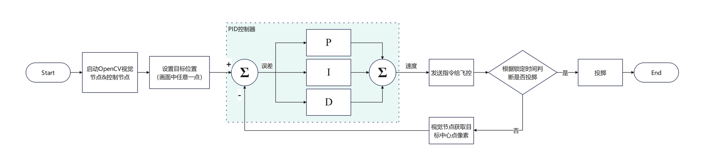

# conductor

the conductor of copter on ROS2 humble

## 无人机硬件配置

- 机架：SpeedyBee Bee35 3.5寸机架
- 飞控：微空MicoAir405飞控（刷入Ardupilot固件）
- 电池：大黄狗电池6S 1380mah 150C
- 螺旋桨：GEMFAN乾丰D90S-3螺旋桨3.5寸三叶涵道
- 无刷电机：酷飞axisflying C206电机 1960kv
- 遥控器：JumperT20遥控器 内置 915Mhz ELRS高频头
- 接收机：贝壳ELRS接收机 915Mhz
- 电调：JHEMCU津航55A四合一电调
- 机载电脑：Milk-V meles 8G
- 降压模块：自制TPS56637 5V 6A降压模块（给开发板供电）
- 光流传感器MTF-02 2.5米测距光流一体模块（用于室内粗略定位）
- 一些固定用的3D打印件

打印件和降压模块的地址在这里 https://oshwhub.com/discodyer/5v6a-buck-module

**可以在网上购买适合的降压模块，自制模块有烧毁风险，请谨慎**

## 系统框架

无人机使用Ardupilot开源固件，我用的这个飞控需要自行编译，配置文件链接：

无人机和meles开发板使用串口通信，通信协议是Mavlink V2

在ros上有mavros这个包，提供了和无人机通信的接口

无人机室内定位使用光流传感器和激光传感器，定位精度不高

使用OpenCV识别目标图像，计算出偏移量，再通过上位机的PID控制器输出速度控制指令传给飞控，飞机做出响应，使无人机悬停到目标物体正上方

需要调整视觉PID的参数，不同的高度和无人机需要相应调整



### 固件编译教程

为什么我需要编译固件呢？因为我使用的穿越机飞控，并没有被Ardupilot官方支持，商家提供的固件也没有开启Guided模式支持，所以我们需要自行编译一个固件

首先参照[Ardupilot文档](https://ardupilot.org/dev/docs/building-setup-linux.html#building-setup-linux)，克隆Ardupilot仓库

 - https://github.com/ArduPilot/ardupilot.git for the main ardupilot repo

 - https://github.com/your-github-account/ardupilot for your fork of the ardupilot repo


```bash
git clone --recurse-submodules https://github.com/your-github-userid/ardupilot
cd ardupilot
```

按照文档里的介绍，安装依赖，如果你是Ubuntu用户，可以直接执行安装脚本

```bash
Tools/environment_install/install-prereqs-ubuntu.sh -y
```

如果你是其他发行版，请自行安装依赖

随后可以开始编译固件了

签出到合适的稳定分支，我们不使用master分支

```bash
git checkout Copter-4.5.6
```

更新一下submodule到这个分支版本需要的版本

```bash
./Tools/gittools/submodule-sync.sh
```

然后需要手动在ardupilot仓库下添加我使用的这个飞机的固件描述文件，在本仓库的hwdef/MICOAIR405文件夹下，请将`MICOAIR405`复制到ardupilot仓库下的`libraries/AP_HAL_ChibiOS/hwdef/MICOAIR405`目录下，随后我们开始固件的编译

```bash
Tools/scripts/build_bootloaders.py MICOAIR405
./waf configure --board MICOAIR405
./waf copter
```

随后我们就完成了固件的编译，目前我使用的是4.5.6版本，4.5.7测试过是可以正常编译的，后续退出新版本有可能会出现链接失败的情况，那就需要手动关闭一些功能以节省flash空间

### 无人机调参

参阅ArduPilot官方文档

### 部署环境

当前仓库是无人机控制节点，还需要使用另外一个OpenCV视觉识别节点 [uaveyes](https://github.com/discodyer/uaveyes)

首先在你的系统上安装 ROS2 humble 并配置好colcon环境

需要mavros这个包

```bash
mkdir -p ros2_ws/src
cd ros2_ws/src
git clone -b ros2 https://github.com/discodyer/conductor.git
git clone https://github.com/discodyer/uaveyes.git
cd ..
colcon build
```

编译完成后，source一下设定脚本

```bash
source ./install/setup.bash
```

可以使用下面的命令运行节点

```bash
ros2 run uaveyes red_circle_ground.py
ros2 run conductor test_fixed_point_ctrl
```
